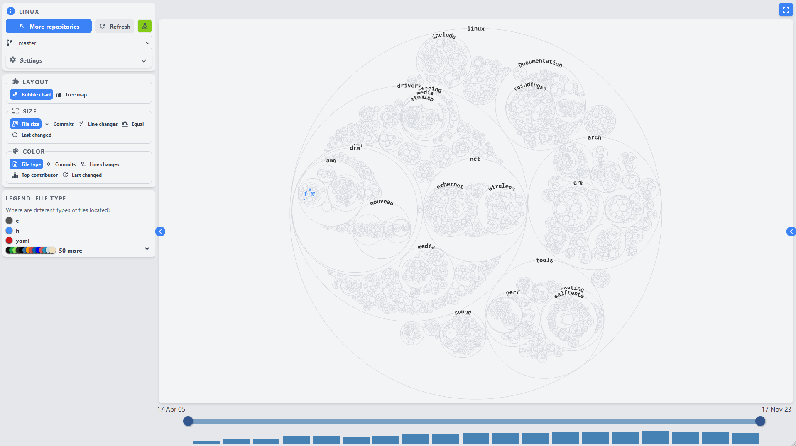

# Git Truck - visualize your repo

Git Truck allows you to get an understanding of how your repository is structured, where there has been the most activity at different points in time, and who worked on which parts of the code base.

## Local analysis of the `.git` folder

🔒 GitTruck analyses the history of your project based on your local .git folder. It runs **completely locally**, so your code stays on your machine, and it is **never uploaded to the cloud**, as is the case with many similar tools.

## How does it work?

For each file in your repository, Git Truck allows you to map metrics onto it:

- the size of files (e.g. the file size in bytes, the number of commits to the file, etc.),
- the color of files (e.g. how many line changes have occured to the file, or who is the top author).

You can mix and match these metrics to answer different questions about your project. The following examples show a few questions that Git Truck can answer for your team:

### 👨‍💻 Are we overreliant on one developer?

Example from [Supabase](https://github.com/supabase/supabase) -- an open source Firebase alternative.

### 💻 Where in the system have we been working recently?

Example from [Pocketbase](https://github.com/pocketbase/pocketbase) -- another alternative to Firebase.

### 🗓️ How has our focus shifted over time?

By selecting different time intervals on which the analysis is performed, in the [Zeeguu frontend](https://github.com/zeeguu/web/) project, one can see various stages of the project:

1. At first, most activity was focused on the "teacher"-folder, with Sara being the top author.

2. Later, focus shifted to the "exercises"-folder, with no activity in the "teacher"-folder, and Mircea is now the top author.

### ⚠️ Do some files have extreme levels of activity, indicating poor separation of concerns?

Example from [Pandas](https://github.com/pandas-dev/pandas)

### 🛠️ Who is responsible for different subsystems?

### 📂 What is the folder structure of a complex project?

Example from [Linux](https://github.com/torvalds/linux)

## How to get started

The only requirements are

- [nodejs](https://nodejs.org/en/) version 18 to 21 (Node 22 is only supported on Mac and Linux)
- [git](https://git-scm.com/downloads) version 2.29 or newer.

To run git truck, navigate to a repository or a folder containing multiple repositories in your terminal, and run `npx git-truck`

