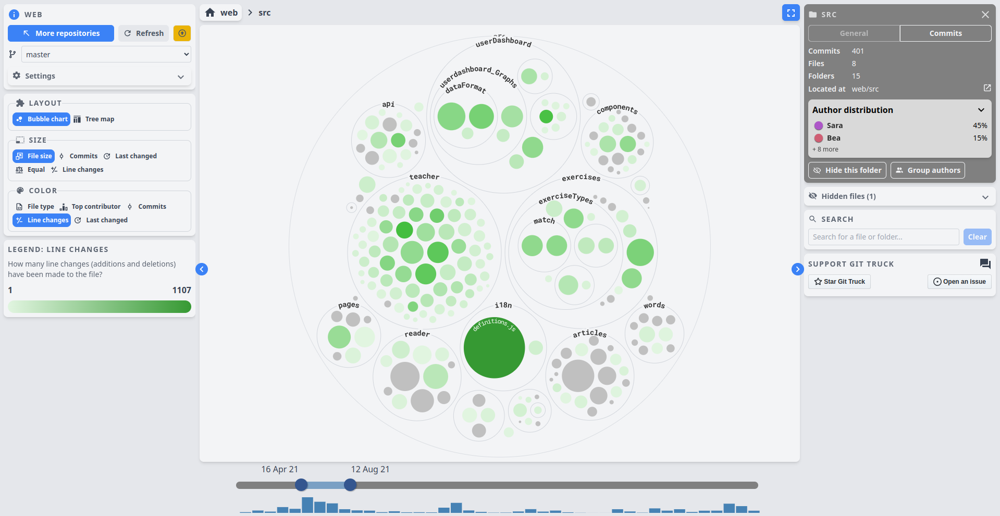

# Git Truck - visualize your repo

Git Truck allows you to get an understanding of how your repository is structured, where there has been the most activity at different points in time, and who worked on which parts of the code base.

## What it can help you with

Git Truck allows you to decide which metrics should be applied to the size of files (e.g. the file size in bytes or the number of commits to the file), as well as the color of the file (e.g. how many line changes have occured to the file, or who is the top author).

You can mix and match these metrics to answer different questions about your project. The following examples show a few questions that Git Truck can answer for you.

### ⚠️ Do some files have extreme levels of activity, indicating poor separation of concerns?

### 💻 Where in the system have we been working recently?

### 👨‍💻 Are we overreliant on one developer?

### 🗓️ How has our focus shifted over time?

At first, most activity was focused on the "teacher"-folder, with Sara being the top author.

Later, focus shifted to the "exercises"-folder, with no activity in the "teacher"-folder, and Mircea is now the top author.

### 🛠️ Who is responsible for different subsystems?

## How to get started

The only requirements are [nodejs](https://nodejs.org/en/) version 16.13 or newer and [git](https://git-scm.com/downloads) version 2.29 or newer.

To run git truck, navigate to a repository or a folder containing multiple repositories in your terminal, and run `npx git-truck@duck`

This version is still in development, so please report any hiccups you might encounter.