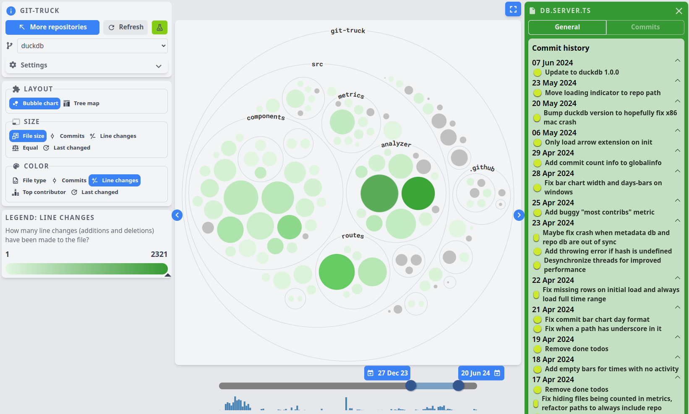
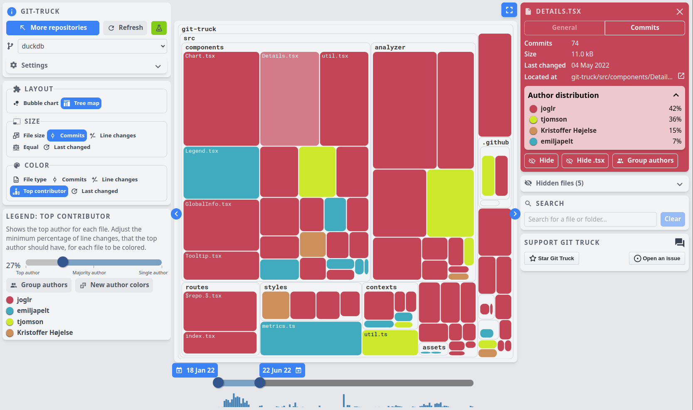

# Git Truck 🚛 &middot;  

Git Truck is a tool that provides you with a truckload of visualizations of your git repository.

With Git Truck you can:

- See who worked on different parts of the project
- Get an overview of the file structure
- See where there is the most activity in your project
- See how your project has looked at different points in time

| | |
|-|-|
|  |  |

You can read more about the features in the [feature overview](https://git-truck.github.io/git-truck/GitTruckTeaser), or just try it and start exploring your projects!

## [Get started](#get-started)

1. In your terminal, navigate to a git repository or a folder containing several repositories

2. Run the command `npx -y git-truck`

3. The application will now open in your default browser. Happy trucking!

> [!NOTE]  
> To use Git Truck, you will need to have the following programs installed:
> - [Node.js](https://nodejs.org/en/) 18.0.0 or newer and npm 10.0 or newer
> - [git](https://git-scm.com/downloads) 2.29 or newer
> 
> Check your installed versions using `node --version`, `npm --version` and `git --version`.

## [What makes Git Truck different?](#what-makes-git-truck-different)

🔒 Private by design

🏝️ Works offline

🤷 Git provider agnostic - works with any git repository

😊 No tracking, no ads, no cloud, no servers, no subscription 
